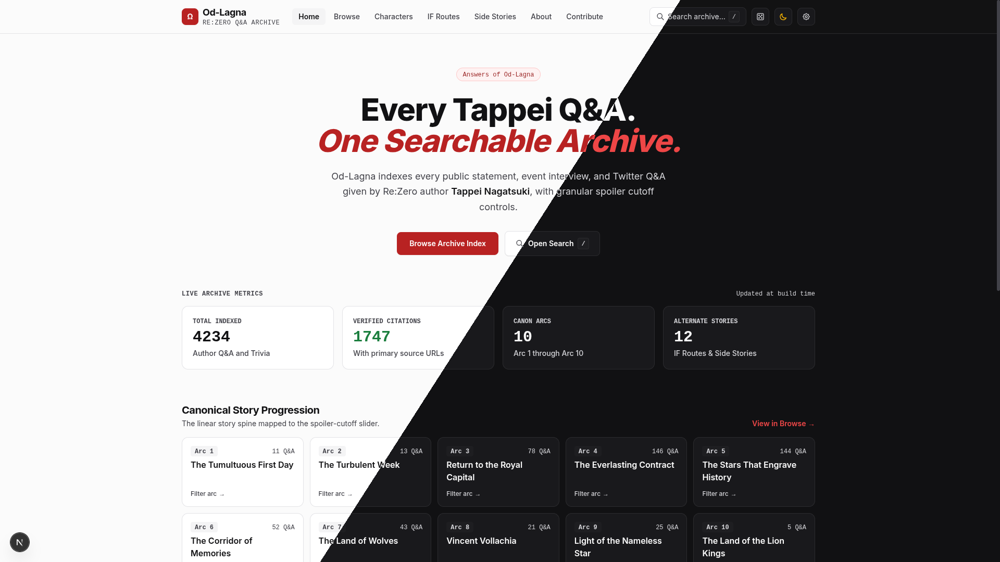
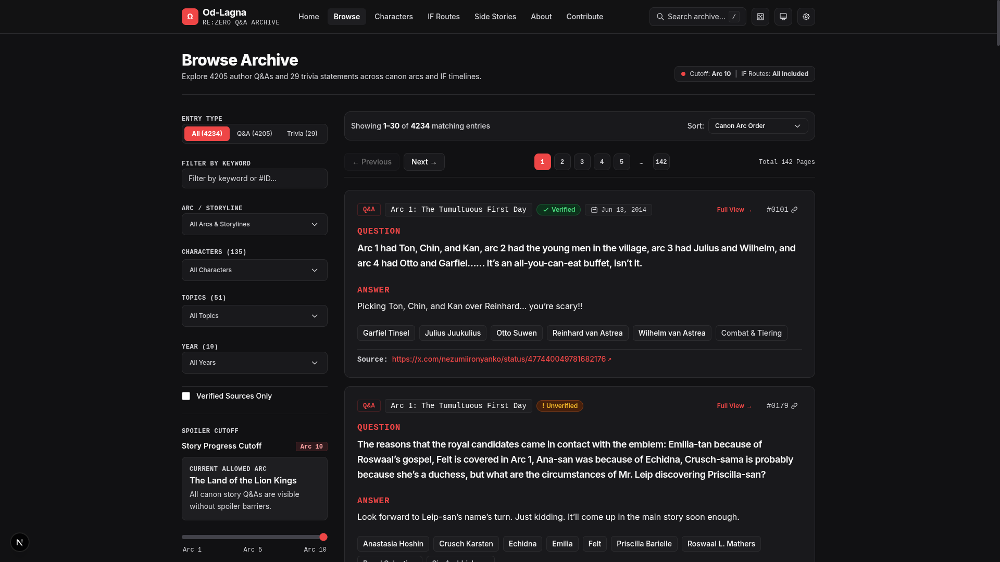
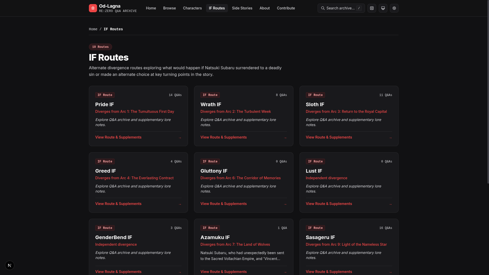
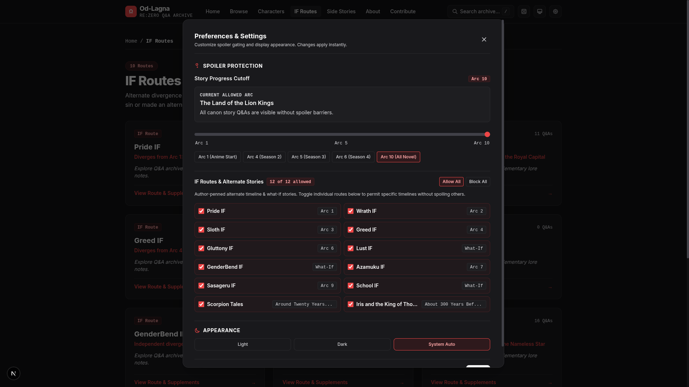

# Od-Lagna

A searchable, spoiler-safe archive of author Q&As, interviews, and lore statements by *Re:Zero kara Hajimeru Isekai Seikatsu* creator **Tappei Nagatsuki**.

[Website](https://od-lagna.pages.dev) | [Browse Archive](https://od-lagna.pages.dev/browse) | [Character Profiles](https://od-lagna.pages.dev/characters) | [IF Stories](https://od-lagna.pages.dev/ifs)



---

## Overview

Over the past decade, *Re:Zero* author Tappei Nagatsuki has answered thousands of fan questions across Twitter sessions, convention appearances, art books, and magazine interviews. These responses provide valuable context on characters, worldbuilding, and alternate storylines, but have been scattered across internet.

Od-Lagna was created to collect, categorize, and cross-reference these statements in a single static archive, equipped with reader-controlled spoiler filters so fans can explore lore safely.

---

## Key Features

- **Spoiler Protection**: Filter statements behind an arc cutoff barrier (Arcs 1 through 9, plus anime season presets) and independent IF route toggles. Content beyond the selected threshold remains masked until manually revealed.
- **Search**: Search across questions, answers, characters, topics, and entry IDs.
- **Bookmarks & Favorites**: Save Q&A and trivia entries locally in your browser with one-click bookmarking. Access, filter, and sort your personal collection, with JSON backup export/import and shareable URL hash sync for cross-device transfer.
- **Random Entry**: Quickly load a random statement filtered strictly within the user's active spoiler boundaries.
- **Characters**: Canonical debut arcs, aliases, affiliations, and associated author statements for major figures.
- **IF Routes and Side Stories**: Cataloged directory covering alternate what-if routes, side stories and related author commentary.
- **Verified Citations**: Statements track primary sources (original Japanese tweets, convention panels, published fanbooks) with verification status badges.

---

## Interface Showcase

| Browse & Filters | IF Routes Directory | Spoiler Protection |
| :---: | :---: | :---: |
|  |  |  |
| Searchable index with character, topic, and arc filters. | Hubs for alternate storylines and author supplements. | Arc-level gating with independent IF route toggles. |


## Contributing

Contributions from the community help keep this archive accurate, properly cited, and up to date.

### How to Submit Content
- **New Q&As**: Open a GitHub Issue containing the question, translated answer, relevant arc or IF route, associated characters/topics, and a primary source link.
- **Google Doc Submission**: You can also provide Q&A entries directly via this [Google Document](https://docs.google.com/document/d/1-yXkWranORjknet7cxOGEhOuafEilxk6Oaj6-fSMOFw/edit?tab=t.isa9vixpx82s#heading=h.3zujftrfbgoi).
- **Reddit Contact**: For any queries, feedback, or to share Q&As directly, you can message [u/Mildly_Confused_NPC](https://www.reddit.com/user/Mildly_Confused_NPC) on Reddit.
- **Source Verification**: If an existing entry is unverified and you have the original Japanese source (tweet URL, event recording, publication issue), please link it in an issue referencing the entry ID (e.g. `#0042`).
- **Corrections**: Translation adjustments, typo fixes, or miscategorized tags can be submitted via an issue or pull request.

### Local Development

Prerequisites: Node.js 18+ and npm.

```bash
# Clone the repository
git clone https://github.com/PixelStarForge/Od-Lagna.git
cd Od-Lagna

# Install dependencies
npm install

# Start the development server (http://localhost:3000)
npm run dev

# Validate all content files against Zod schemas
npm run validate

# Run schema and loader test suites
npx tsx lib/schema.test.ts

# Build static production bundle
npm run build
```

---

## Disclaimer and Copyright

Od-Lagna is an unofficial, non-commercial fan project created for archival, reference, and educational purposes under fair use.

*Re:Zero kara Hajimeru Isekai Seikatsu*, its characters, settings, and original Japanese text are the intellectual property of **Tappei Nagatsuki**, **Kadokawa**, and illustrator **Shinichirou Otsuka**.

